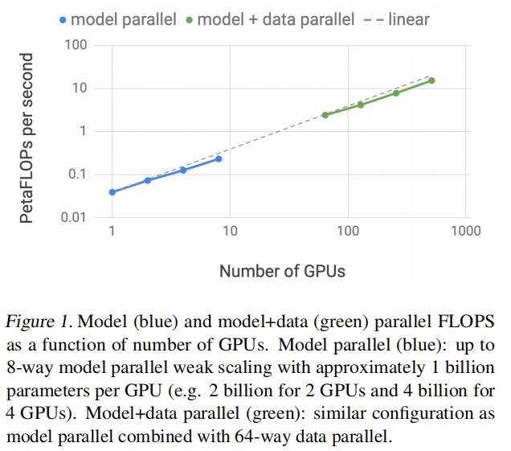
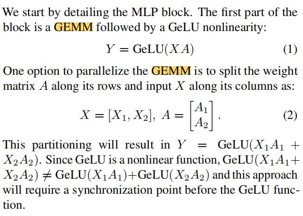
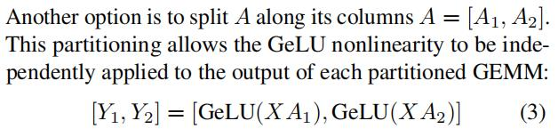
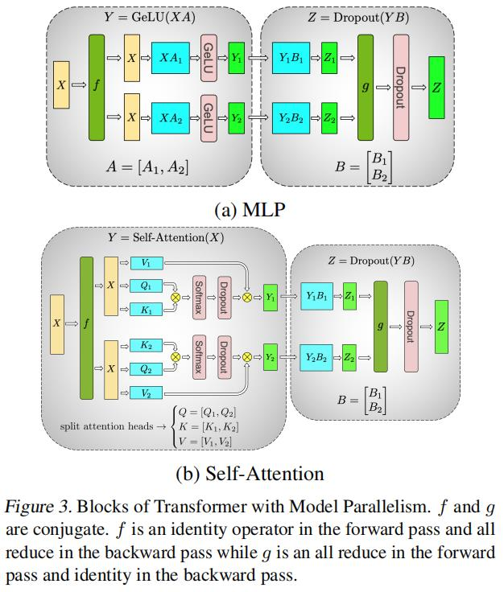

# Megatron-LM: Training Multi-Billion Parameter Language Models Using

## Abstract

### 主要工作内容  
- In this work, we present our techniques for training very large transformer models and implement a simple, efficient intra-layer model parallel approach that enables training transformer models with billions of parameters.
- 在这项工作中，我们提出了我们的训练大型transformer模型的技术，并实现了一个简单、有效的层内模型并行方法，使训练具有数十亿参数的transformer模型。

### 方法便捷性亮点
- Our approach does not require a new compiler or library changes, is orthogonal and complimentary to pipeline model parallelism, and can be fully implemented with the insertion of a few communication operations in native PyTorch.
- **我们的方法不需要新的编译器或库的更改，它是与pipeline模型并行性正交和互补的，并且可以通过在本机PyTorch中插入一些通信操作来完全实现。**

### 在模型参数扩展上的改进
- We illustrate this approach by converging transformer based models up to 8.3 billion parameters using 512 GPUs. We sustain 15.1 PetaFLOPs across the entire application with 76% scaling efficiency when compared to a strong single GPU baseline that sustains 39 TeraFLOPs, which is 30% of peak FLOPs.
- 我们通过使用512个gpu收敛基于transformer的高达83亿个参数的模型来说明这种方法。我们在整个应用程序中维持了15.1个PetaFLOPs，具有76%的扩展效率，而它维持了39个TeraFLOPs，占峰值FLOPs的30%。

### 精度效果
- To demonstrate that large language models can further advance the state of the art (SOTA), we train an 8.3 billion parameter transformer language model similar to GPT-2 and a 3.9 billion parameter model similar to BERT.We show that careful attention to the placement of layer normalization in BERT-like models is critical to achieving increased performance as the model size grows. Using the GPT-2 model we achieve SOTA results on the WikiText103 (10.8 compared to SOTA perplexity of 15.8) and LAMBADA (66.5% compared to SOTA accuracy of 63.2%) datasets. Our BERT model achieves SOTA results on the RACE dataset (90.9% compared to SOTA accuracy of 89.4%).
- 为了证明大型语言模型可以进一步推进最先进的技术(SOTA)，我们训练了一个类似于GPT-2的83亿个参数转换器语言模型和一个类似于BERT的39亿个参数模型。我们表明，在类似bert的模型中，仔细注意层标准化的放置对于提高随着模型大小增长的性能至关重要。使用GPT-2模型，我们在维基文本103(10.8SOTA困惑为15.8)和SOTA(66.5%SOTA准确性为63.2%)数据集上获得了SOTA结果。我们的BERT模型在RACE数据集上获得了SOTA的结果(90.9%，而SOTA的准确率为89.4%)。


## Introduction

### 扩展性
- 展示扩展效果，虚线是线性比100%的实例，蓝色线是单机8卡的示例，绿色部分是使用dp扩展64倍的结果，主要是说明扩展64倍后线性度没有下降，方法的扩展性好


### contributions
1. 实现了tensor-model-parallel
    - We implement a simple and efficient model parallel approach by making only a few targeted modifications to an existing PyTorch transformer implementation.
    - 我们通过对现有的PyTorch转换器实现进行一些有针对性的修改，实现了一种简单而高效的模型并行方法。
2. 扩展效率好
    - We perform an in-depth empirical analysis of ourmodel and data parallel technique and demonstrate up to 76% scaling efficiency using 512 GPUs.
    - 我们对我们的模型和数据并行技术进行了深入的实证分析，并使用了512个gpu显示了高达76%的扩展效率。
3. LN的位置重要
    - We show that careful attention to the placement of layer normalization in BERT-like models is critical to achieving increased accuracies as the model grows.
    - 我们表明，在类似bert的模型中，LN的位置对于随着模型的增长而提高精度是至关重要的。
4. 参数量增加可以使精度进一步提高
    - We demonstrate that scaling the model size results in improved accuracies for both GPT-2 (studied up to 8.3 billion parameters) and BERT (studied up to 3.9B parameters) models.
5. SOTA
    - We showcase that our models achieve state of the art results on test sets: perplexity on WikiText103 (10.8 ppl), accuracy on LAMBADA (66.5%), and accuracy on RACE (90.9%).
6. 开源
    - We open source our code along with the training and evaluation pipelines at https://github.com/NVIDIA/Megatron-LM

## Background and Challenges

1. Neural Language Model Pretraining
2. Transformer Language Models and Multi-Head
Attention
3. Data and Model Parallelism in Deep Learning

## Model Parallel Transformers
- 重点来了

1. 在MLP中常见的一个操作就是mm+gelu(GEMM)
2. 一种方法是**沿着其行(raw)将weight矩阵A分割，并沿着其列(columns)输入X分割**，来实现tensor-model-parallel，从下图中我们可以看出，在该方法下，需要通过同步来保障语义对等
  - 
3. 另一种方法是**沿着它的列(columns)分割A**，这种方法的好处是保障了各自在独立运行GEMM时的语义对等，对于一个module的正向输出在各卡上的同步，就需要2种所描述的方法来保障了
  - 
4. 使用3的方法我们可以看到，使用了同一个X，这样在反向的时候需要梯度同步来保障module的反向输出在各卡上的同步，在PyTorch中，我们可以轻松实现这个功
```python
class f(torch.autograd.Function):
   def forward(ctx, x):
    return x
   def backward(ctx, gradient):
    all_reduce(gradient)
    return gradient
```
5. 图示，对于一个MLP，进来先进行方法3，然后使用方法2，实现MLP的整体的tensor-model-parallel且语义和原始MLP对等；该方法同样可以扩展到Self-Attention模块
  - 
6. 实际上仔细想想，这个方法其实在Self-Attention立，语义并非完全和单卡一致的，尤其是softmax
