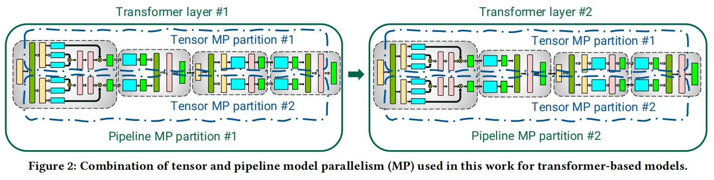
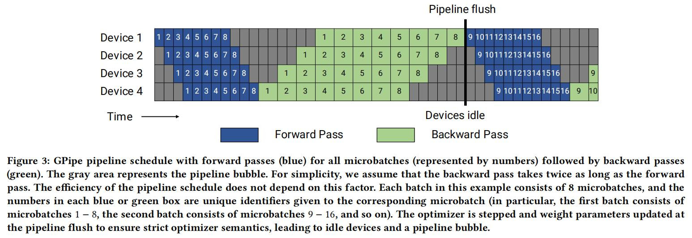
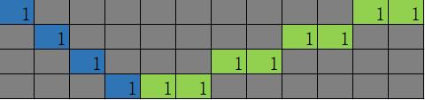
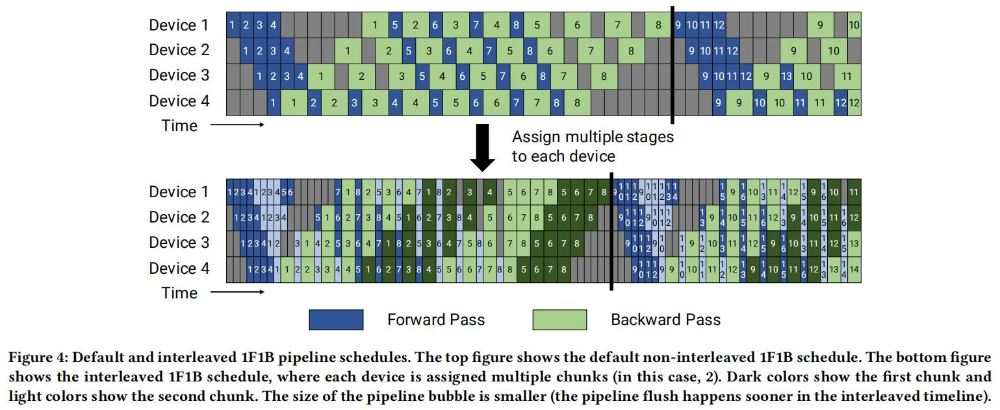
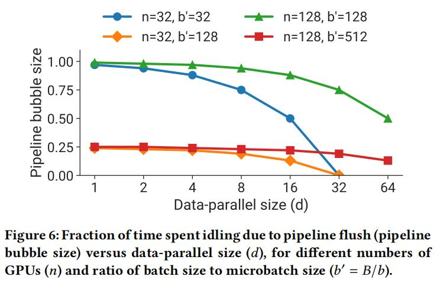

# Efficient Large-Scale Language Model Training on GPU Clusters Using Megatron-LM

- paper: https://arxiv.org/pdf/2104.04473.pdf
- github: https://github.com/NVIDIA/Megatron-LM
- 整体来说，这篇文章更贴近实际场景，就如何混用各种技巧，使运行效率最大化展开了研讨

## Abstract
1. In this paper, we show how tensor, pipeline, and data parallelism can be composed to scale to thousands of GPUs. We propose a novel interleaved pipelining schedule that can improve throughput by 10+% with memory footprint comparable to existing approaches.
2. 在本文中，我们展示了如何将张量、pipeline和数据并行度扩展到数千个gpu。我们提出了一种新的交错流水线调度，与现有的方法相比，其内存占用可以提高10+%的吞吐量。

## INTRODUCTION
1. In addition, we studied the interaction between the various components affecting throughput, both empirically and analytically when possible. Based on these studies, we offer the following guiding principles on how to configure distributed training:
    1. 此外，我们还研究了影响吞吐量的各种成分之间的相互作用，并在可能的情况下进行了经验和分析。基于这些研究，我们提供了以下关于如何配置分布式培训的指导原则：
2.  Different forms of parallelism interact in non-trivial ways: the parallelization strategy has an impact on the amount of communication, the compute efficiency with which kernels are executed, as well as the idle time workers spend waiting for computation due to pipeline flushes (pipeline bubbles). For example, in our experiments, we found that sub-optimal combinations of tensor and pipeline model parallelism can lead to up to 2× lower throughput, even with high-bandwidth network links between servers; tensor model parallelism is effective within a multi-GPU server, but pipeline model parallelism must be used for larger models.
    1.  不同形式的并行性以非平凡的方式相互作用：并行化策略对通信量、执行内核的计算效率以及由于pipeline刷新（pipeline气泡）而等待计算的空闲时间都有影响。例如，在我们的实验中，我们发现张tensor和pipeline模型并行性的次优组合可以导致高达2×的低吞吐量，即使是服务器之间的高带宽网络链接；tensor模型并行性在多gpu服务器中是更高效的，但是pipeline模型并行性必须用于更大的模型。
    2.  主要是说pipeline并行中的空档/水泡(bubbles)可能会造成2x以上的吞吐量下降，虽然tensor-model-parallel高效，但是在超大模型中，pipeline并行也是不可或缺的
3.  The schedule used for pipeline parallelism has an impact on the amount of communication, the pipeline bubble size, and memory used to store activations. We propose a novel interleaved schedule that can improve throughput by as much as 10% compared to previously-proposed schedules [20, 30] with comparable memory footprint.
    1.  用于pipeline并行性的计划对通信量、pipeline气泡大小和用于存储激活的内存都有影响。我们提出了一种新的交错调度，与之前提出的具有类似内存占用的调度[20,30]相比，它可以提高高达10%的吞吐量。
    2.  这个schedule我们可以在后文及代码中看到，看起来有点类似跑多步step一次的感觉
4.  Values of hyperparameters such as microbatch size have an impact on the memory footprint, the arithmetic efficiency of kernels executed on the worker, and the pipeline bubble size. In our experiments, the optimal value of the microbatch size is problem-dependent and can increase throughput by 15%.
    1.  超参数的值，如microbatch大小，会对内存占用、在工作者上执行的内核的算术效率和pipeline气泡大小产生影响。在我们的实验中，microbatch大小的最优值是与问题相关的，可以增加15%的吞吐量。
    2.  这个虽然卡起来感觉有点牵强，实际上在pipeline并行的时候，microbatch大小决定了pipeline各节点的等待时长，这对于pipeline的并行效率尤为关键
5.  At scale, distributed training is communication-intensive. When training a trillion-parameter model on 3072 GPUs, our implementation used an effective bisection bandwidth of 892 GB/s for pipeline-parallel communication, and 13 TB/s for data-parallel communication. Using slower inter-node interconnects or more communication-intensive partitionings would hinder scaling performance.
    1.  在大规模上，分布式培训是沟通密集型的。当在3072个gpu上训练一个万亿参数模型时，我们的实现使用了892GB/s的有效二分带宽用于pipeline并行通信，13TB/s用于数据并行通信。使用较慢的节点间互连或更多的通信密集型分区将阻碍扩展性能。
    2.  这一点实际上是有指导意义的，大模型训练做到最后，主要的优化一定是在优化通信时间消耗上，尤其是pipeline并行和数据并行

## MODES OF PARALLELISM
- 在本节中，我们将讨论并行性技术，以促进对不适合单个GPU内存的大型模型的有效训练。在这项工作中，我们将pipeline模型的并行性和张量模型的并行性（如图2所示的组合）与数据的并行性结合起来。我们将此简称称之为PTD-P。
- 
1. Data Parallelism
   1. DP/DDP大家都很熟悉，就不再赘述了
2. Pipeline Model Parallelism
   1. pipeline并行是把一个模型的不同layer拆分到不同的卡上从而实现的一种并行方式，
   2. 在每批开始和结束时，设备都空闲。我们把这种空闲时间称为pipeline bubble，并希望使它尽可能小。
   3. 异步和边界态的方法如 PipeMare, PipeDream, and PipeDream-2BW可以让pipeline完全流起来，但是再语义上却没有做到很好的把控对齐。本文不讨论这些方法。
   4. GPipe
   5. 
   6. 这个其实有点类似跑多个step累加gard，然后一次到同步点时(这里是8)做一次optim.step()来完成权重的更新同步。这里我们可以看到，图假设了pipeline是4，8个周期横轴长度为8(fp)+16(bp)+9(bubble)=33
   7. 
   8. 我对比做了个如果常规跑的图，1个周期横轴长度为4(fp)+8(bp)=12，8个周期为12*8=96，对比可以看出，尤其是在pipeline并行的场景，跑多batch后累计梯度更新一次是非常高效有意义的
   9. Schedule with Interleaved Stages
   10. 这就更进一步了，假设了每张卡内部还可以把流水开起来，例如原来设备1有层1−4，设备2有层5−8，那么我们可以让设备1有层1,2,9,10,设备2有层3,4,11,12,这样就可以进一步压缩bubble
   11. 
   12. 这里深蓝色表示第一个chunk(i.e 0,1)，浅蓝色表示第二个chunk(i.e 9,10)，我们可以看到，理想状态下，并行效率被进一步提高。实际上作者这里也意识到，这样做会带来额外的通信量，在下一节中，作者会讨论如何在多gpu服务器(例如，DGXA100节点)中利用8个无限带网卡来减少这种额外通信的影响。
3. Tensor Model Parallelism
   1. 这里就是上篇文章的内容，不再赘述
   
## PERFORMANCE ANALYSIS OF PARALLELIZATION CONFIGURATIONS

- 这部分作者一通分析，得到了一些要点，这边的就直接贴要点了。这些要点也是比较符合直觉的

1. Tensor and Pipeline Model Parallelism的要点
   1. 当考虑不同形式的模型并行性时，当使用𝑔-gpu服务器时，tensor模型并行度通常应该使用到𝑔度，然后pipeline模型并行性可以用来跨服务器扩展到更大的模型。
   2. 简单说就是tensor模型并行尽可能在单个服务器内部cover，g表示该服务器有几张卡，通常为8，pipeline模型并行性可以用于跨服务器的并行
2. Data and Model Parallelism的要点
   1. Pipeline Model Parallelism中microbatches带来的影响
   2. 
   3. 

